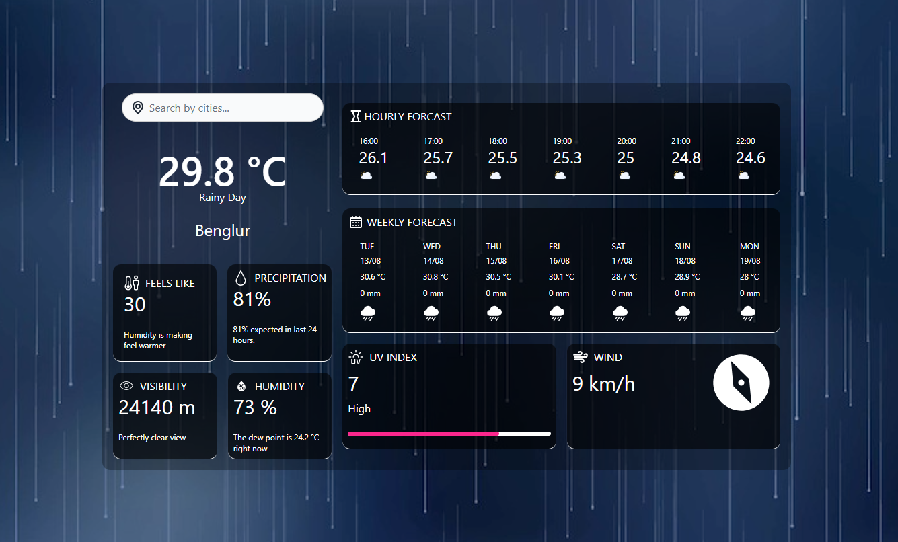
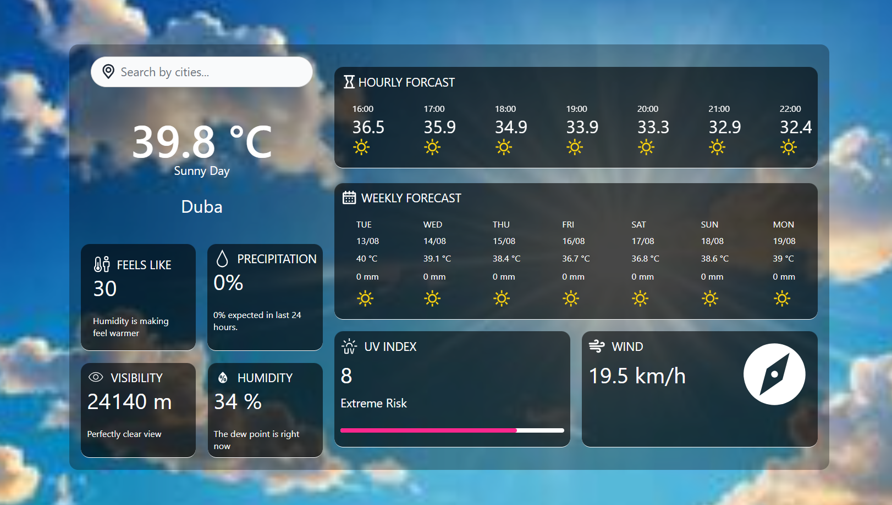
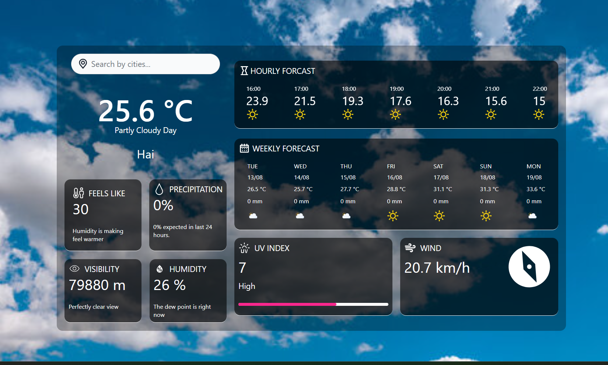
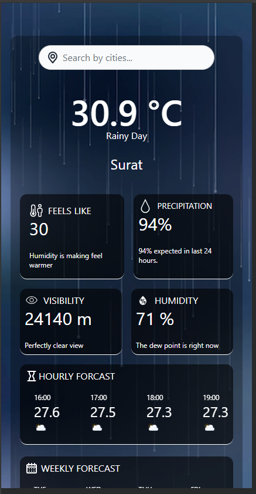
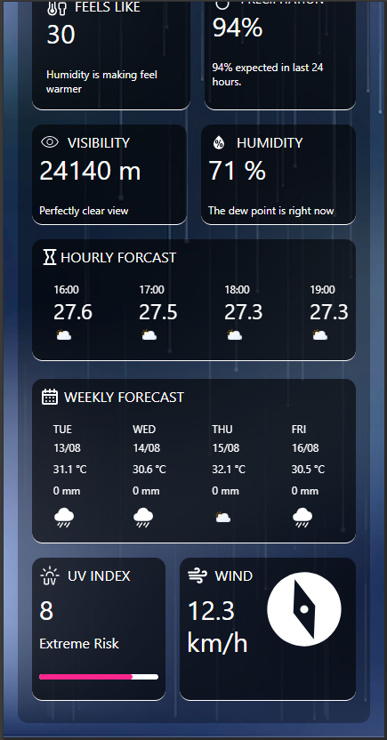

# weather-tracker

 Vue 3 in Vite.

## Recommended IDE Setup

[VSCode](https://code.visualstudio.com/) + [Volar](https://marketplace.visualstudio.com/items?itemName=Vue.volar) (and disable Vetur).

## Customize configuration

See [Vite Configuration Reference](https://vitejs.dev/config/).

## Project Setup

```sh
npm install
```

### Compile and Hot-Reload for Development

```sh
npm run dev
```

### Compile and Minify for Production

```sh
npm run build
```

## 🚀 **Used Packages**

- **Axios**: Handle HTTP requests  
- **Vue Router**: For routing  
- **Flowbite**: For UI components  
- **Moment.js**: For date and time manipulation  
- **Pinia**: For state management  
- **Tailwind CSS**: For CSS design  

## 📸 **Screenshots**

Here are some screenshots of the project:

### Rainy Day


### Sunny Day


### Cloudy Day


### Mobile View
<div style="display: flex; gap: 10px;">
    
    
</div>

### Demo

<a href="https://dsapariya.github.io/weather-tracker/" target="_blank">Demo</a>
